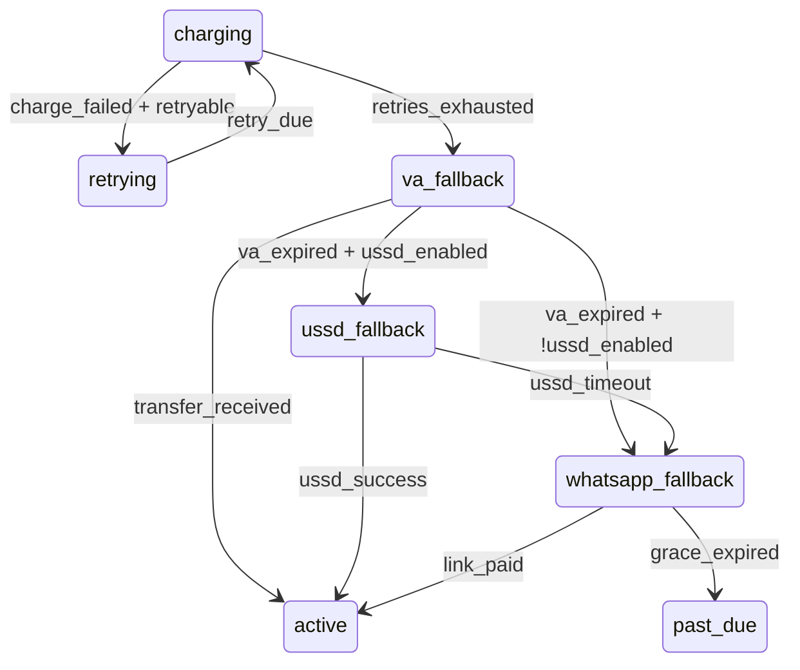

When a recurring card charge fails, RailSwitch activates the **multi-rail dunning cascade** — an escalating sequence of payment rails designed to recover revenue where cards fail. Nigerian card decline rates run 20–30%, but most customers *can* pay through other channels.

## The Cascade

| Stage | Rail | Trigger | Action |
|-------|------|---------|--------|
| 1 | Smart Card Retries | First charge fails | Payday-aware, liquidity-optimized retries with exponential backoff + jitter. 0–5 retries per merchant config. |
| 2 | Virtual Account Fallback | Card retries exhausted | Generates a one-time Nomba VA scoped to this subscription + billing cycle. Amount-locked, expires in 7 days. Customer transfers from their banking app. |
| 3 | USSD Push (conditional) | VA expires unpaid | Triggers Nomba USSD payment prompt for supported banks. Configured per-merchant via `ussdEnabled` flag. Skipped in tri-rail mode. |
| 4 | WhatsApp Recovery | VA/VA+USSD expires | Templated WhatsApp Cloud API message with all remaining options — VA details, USSD code, retry link. |

If all rails are exhausted, the subscription enters `past_due` (grace period), then `cancelled`.

## Tri-Rail Mode

When USSD is not available for a merchant (`ussdEnabled: false`), the cascade skips directly from VA fallback to WhatsApp — a tri-rail cascade. The architecture supports enabling USSD later without code changes.

## Smart Retry Engine

Retry timing is not naive. The engine considers:

- **Payday awareness** — retries bias toward the 25th–30th of the month (Nigerian salary dates)
- **Liquidity windows** — retries snap to 10:00–14:00 WAT when bank channels are most likely to succeed
- **Exponential backoff with jitter** — base delay × 2^retry_count, ±15% jitter to prevent thundering herds
- **Per-merchant config** — retry count, base delay, and max delay are configurable per merchant

## State Transitions

Each rail corresponds to a state machine transition:

## Webhook Events

The cascade emits these events as it progresses:

| Event | When |
|-------|------|
| `charge.failed` | Initial card charge fails |
| `charge.succeeded` | Card retry succeeds |
| `dunning.cascade_started` | First retry initiated |
| `va.created` | Virtual Account generated for this cycle |
| `va.credited` | Customer transfers into the VA |
| `va.expired` | VA expires unpaid |
| `ussd.triggered` | USSD push sent to customer |
| `whatsapp.sent` | WhatsApp recovery message delivered |
| `dunning.exhausted` | All rails failed, entering past_due |

## Configuring the Cascade

Per-merchant dunning policy can be configured in the [Dashboard](https://railswitch-gateway.fly.dev) under Settings → Dunning:

- **Retries** — 0 to 5 card retry attempts
- **Rail order** — drag to reorder Card → VA → USSD → WhatsApp
- **Per-rail toggles** — enable or disable individual rails
- **Grace period** — days in `past_due` before auto-cancellation
